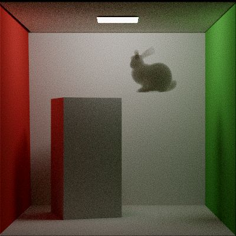
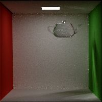
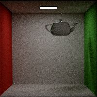
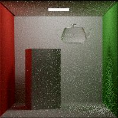
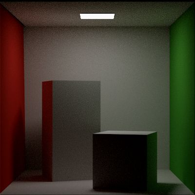
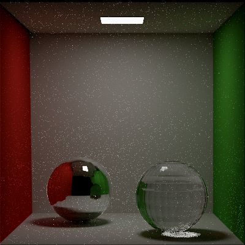
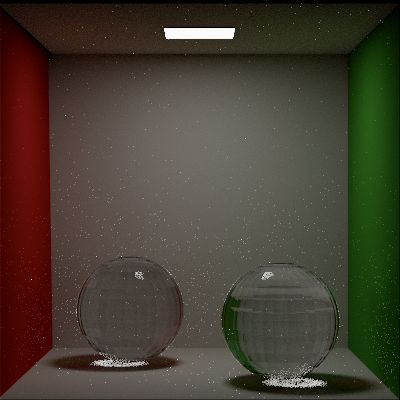
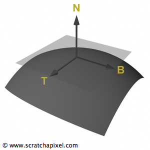

# Current results

> Volume path tracing

> BDPT rendered glass teaport in Cornell box w/ MIS

> BDPT rendered glass teaport in Cornell box w/o MIS

> Path traced glass teapot
 (note noisy causitcs)

> Cornell box original (400x400, 64spp)

> Cornell box spheres (400x400, 64spp)

> Cornell box two glass spheres (400x400, 64spp)

# `lib` Core
## IO

### `class` FileException
### `class` FileUtil
### `class` JsonObject [-]
>`JsonObject` holds basic json objects, at any hierarchy level.

|Member|Type|Accessibility|
|:--:|:--:|:--:|
|_document| const JsonDocument *| `protected` |
|_value| const rapidjson::Value *| `protected` |

|Interface|Accessibility||
|:--:|:--:|:--:|
|[void fill(bool&) const](#jsonobjectfillbool)|public|
|[void fill(int&) const](#jsonobjectfillint)|public|
|[std::string getString() const](#jsonobjectgetstring)|public|
|[**Mat4f** JsonObject::getTransform() const](#jsonobjectgettransform)|public||

> **void fill(bool&) const**
> **void fill(int&) const**

> **std::string getString() const**
> **getInt()**
> **getBool()**
> **JsonObject operator**

> **Mat4f** JsonObject::getTransform() const
- [ ] Rotation

### `class` JsonDocument [JsonObject]
`JsonDocument` stores and parse .json files.

### `class` ObjHandler
### `class` PpmHandler

## math
### template<T, Size> `class` Point

|Interface|Accessibility|Test
|:--:|:--:|:--:|
|inline **Pointer** permute(int, int, int) const|public|`pass`|

### template<T, Size> `class` Vector
> `Vector` is row-based.
|Interface|Accessibility|Test
|:--:|:--:|:--:|
|inline **ElementType** dot(**Vector** other) const|public|`pass`|
|[inline **Vector** cross(**Vector** other) const](#vectorcorss)|public|`pass`|
|inline **Vector** permute(int, int, int) const|public||

> inline **Vector** cross(**Vector** other) const

- [ ] x() return reference, is it good?
- [ ] How to represent column vectors?

### `class` Mat4f
|Interface|Accessibility|Test
|:--:|:--:|:--:|
|[static **Mat4f** transpose(const **Mat4f&**)](#mat4ftranspose)|public|`pass`|
|static **Mat4f** inverse(const **Mat4f&**)|public||
|static **Mat4f** translate(**Vec3f** t)|public||
|static **Mat4f** scale(**Vec3f** s)|public||
|~~static **Mat4f** rotateXYZ(**Vec3f** r)~~|public||
|[static **Mat4f** rotAxis(**Vec3f** &axis, **float** angle)](#mat4frotaxis)|public|`fixed`|
|static **Mat4f** orthographic(**float** near, **float** far)|public||
|static **Mat4f** perspective(**float** fov)|public|`fixed`|
|friend **Mat4f** operator*(const **Mat4f&** a, const **Mat4f&** b)|-|`pass`|
|friend **Vec4f** operator*(const **Vec4f&** b, const **Mat4f&** a)|-||
|friend **Ved4f** operator*(const **Mat4f&** a, const **Vec4f&** b)|-||
|friend **Point3f** operator*(const **Point3f** b, const **Mat4f&** a)|-|`pass`|
|friend **Vec3f** operator*(const **Vec3f** b, const **Mat4f&** a)|-|`pass`|

> static **Mat4f** transpose(const **Mat4f&**)
> static **Mat4f** rotAxis(**Vec3f** &axis, **float** angle

Rotate points or vectors in **counterclockwise** order in the **right-handed** coordinate system.
- [ ] transpose() should not be static?

### `class` CoordinateSystem
> Used to represent different frames. Use **right hand coord**. 

`Note`
It is important to understand that the name convention used in a coordinate system **has nothing to do** with the handness!

|x|y|z|
|:--:|:--:|:--:|
|u|v|w|
|right|up|forward|

#### Usage Summary

|Interface|Accessibility|Test
|:--:|:--:|:--:|
|[CoordinateSystem(const **Vec3f&** pos, const **Vec3f&** lookat, **Vec3f&** up)](#coordinatesystemlconstructorlookat)|public||

1. BRDF local coordinate (normal space)

    When dealing with intersection and shading, since we can compute derivatives at intersection point, we can obtain normal by their cross product. And construct a local coordinate with this given normal vector.

    Also note that in shading coordinate systems, z is always the `up` vector by convention.

2. intersection?

>  CoordinateSystem(const **Vec3f&** pos, const **Vec3f&** lookat, **Vec3f&** up)
- [ ] Need to verify if it is necessary that camera is facing the -z axis in its own local coordinate.

- [ ] So, for some circumstances, like the BRDF coord, z points upward. This is different from the definition of this class, how to handle?
- [ ] Why constructing normal space do not use the intersected triangle's normal directly? Is that because this is actually computing a shading normal(via derivatives)?

### `class` Bound

## sampler

### `class` Sampler
> Generate n-dimensional samples for pixels.

|Interface|Accessibility|Status|
|:--:|:--:|:--:|
|[**void** startPixel(const **Vec2i&** p)](#samplerstartpixel)|public||
|[**void** startNextSample()](#samplerstartnextsample)|public||
|**void** setSampleIdx(int64_t)|public||
|[**float** get1D()=0](#samplerget1d)|public||
|[**Vec2f** get2D()=0](#samplerget2d)|public||
|[**void** request1DArray(int n)](#samplerrequest1darray)|public||
|**void** request2DArray(int n)|public||
|[**const float\*** get1DArray(int n)](#samplerget1darray)|public||
|**const Vec2f\*** get2DArray(int n)|public||
|**PixelSample** getSensorSample(Vec2i p)|public||

|Member|Accessibility|
|--:|:--:|
|**const int64_t** _spp| `public` |
|**Vec2i** _current_pixel| `protected` |
|**int64_t** _current_pixel_sample_idx|`protected`|
|**std::vector\<int\>** _samples1DArraySizes|`protected`|
|**std::vector\<int\>** _samples2DArraySizes|`protected`|
|**std::vector\<std::vector\<float\>\>** _sampleArray1D|`protected`|
|**std::vector\<std::vector\<Vec2f\>\>** _sampleArray2D|`protected`|
|**size_t** _array1DOffset|`protected`|
|**size_t** _array2DOffset|`protected`|

> **void** startPixel(const **Vec2i&** p)
When sampler instances start to draw samples for a pixel (multiple samples may be genereated for a singel pixel), it calls this function.

>  **float** get1D()=0
Fetch next 1 dimension random variable value in current n-dimensional sample of current pixel.

>  **void** request1DArray(int n)
Called when integrator requires additional dimensions of samples. Must be called before render().

> **const float\*** get1DArray(int n)

- [ ] When exactly will request sample arrays be considered? For which integrators?

### `class` PixelSampler : **public** Sampler
|Member|Accessibility|
|--:|:--:|
|[**std::vector\<std::vector\<float\>\>**](#pixelsamplersamples1d) _samples1D| `protected` |

>  `_samples1D`

Samples in `_samples1D` includes the ones used by sensor. When pixel_sample is been generated, film sample, shutter time and lens sample are fetched from `_samples1D`.

### `class` StratifiedSampler : **public** PixelSampler
### `class` UniformSampler : **public** PixelSampler

# `exe` renderer

## integrators
### `class` Integrator
### `class` Whitted

### `class` PathTraceIntegrator

## primitives
### `class` Primitives
### `class` TriangleMesh

## sensors
### `class` Sensor

- [ ] Now use **LookAt** matrix to place the camera. This has a limit that the camera could not be looking straight up or down. TODO: quaternion.

### `class` Orthographic
### `class` Perspective
- [ ] **Kown bug!**

## Emitters
|Interface|Accessibility|Status|
|:--:|:--:|:--:|
|[**Vec3f** sample_Li(const **IntersectInfo&** isect_info, **Vec3f&** &wi, **float&** pdf, const **Point2f&** u) const](#emittersampleli)
|public||

>  **Vec3f** sample_Li(const **IntersectInfo&** isect_info, **Vec3f&** &wi, **float&** pdf, const **Point2f&** u) const
- [ ] What exactly this function measure? Irradiance or radiance? (From its implementation, seems to be irradiance, but shouldn't radiance be evaluated here?)

### PointEmitter
|Member|Accessibility|
|--:|:--:|
|[**const Vec3f** _I](#pointemitteri)| `public` |

|Interface|Accessibility|Status|
|:--:|:--:|:--:|
|[**void** startPixel(const **Vec2i&** p)](#samplerstartpixel)|public||

>  **const Vec3f** _I
_I denotes the **raidant intensity** of point emitters. It represents the power per unit solid angle emitted by the point emitter. Thus the **power** of this emitter is computed by integral over the sphere of solid angles by this randiant intensity.

> sample_Li()
Since `_I` represents the radiant intensity, i.e. flux per unit solid angle, and that we want to measure the **radiance**, i.e. flux per unit solid angle per unit area on the surface receiving light, we need to devide `_I` by squared length in order to compute the radiance. (squared length is due to the fact that we need to measure flux on a certain sphere whose radius is the length to the origin, and thus compute the area of the sphere, and thus the flux on unit area.)

### SpotlightEmitter
Pointing to `(0,-1,0)` at default.
`_cos_inner`: from center to falloff point.

`_cos_outer`: from center to full width point.

### `class` Box
### `class` Buffer
### `class` Ray
### `class` Scene

### `BDPT`
> Sensor::We
Evaluates importance emitted from sensor at `p` and of direction `w`. `pRaster` returns associated ray position on the film.
This method first needs to check if a valid ray (same direction as the outgoing hemisphere), and returns `0` if invalid.

> Sensor::Pdf_We
Compute spatial and directional pdf.
Note what `theta` refers to.

> Sensor::Sample_Wi

> Emitter::Sample_Le

For BDPT, the sampled point on film is only effective when sampling camera path, while doing particle sampling(light path), the point on film is random.

> Vertex::convertPdf()
Why `theta` is the angle between ray direction and **next**.normal?
